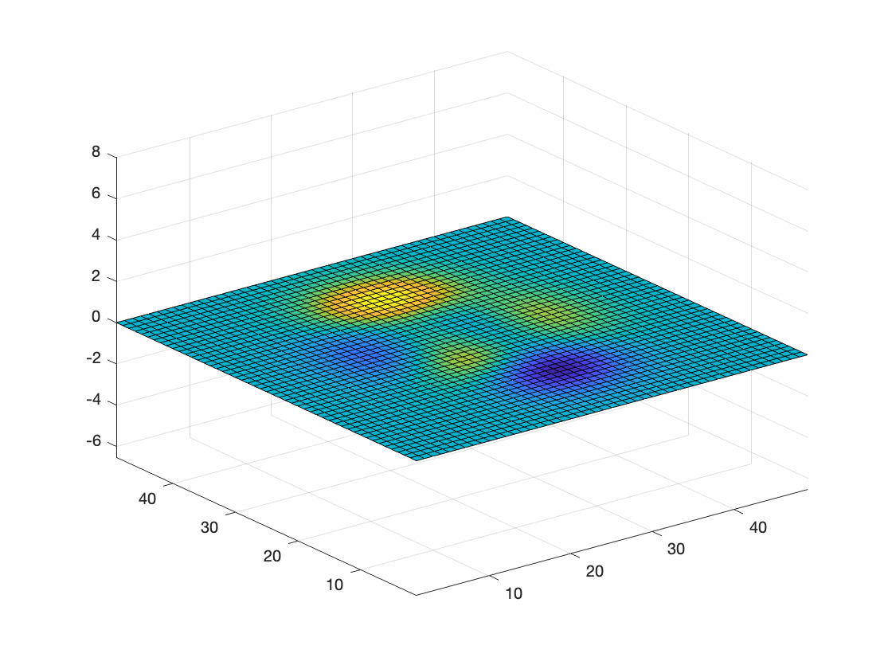

# Example: Animated Plots

Having animated plots would be cool. Let's try to figure out how to export them as video files or animated GIFs or something.

## Plots using for loops

Here's an example of animated plots that you get when you plot stuff in a loop in a Live Script.

```matlab:Code
ax = axes;
axis(ax, [0, 2*pi, -1, 1])
hold(ax, "on")

for i = linspace(0, 2*pi)
    scatter(ax, i, cos(i), 'b')
    drawnow
    pause(0.025)
end
```


When you run the Live Script, it only does one pass through the sequence. How should we handle that?

## Plots using movie

Maybe you can also do animated plots using the `movie` function.

First, you have to enable it in the editor:

```matlab:Code
if verLessThan('matlab', '9.10.0')
    mlSettings = settings;
    mlSettings.matlab.editor.AllowFigureAnimation.TemporaryValue = 1;
end
```

(This is probably not safe to do in widely-used Live Scripts. An `onCleanup` and a `clear` could somewhat take care of this.)

Record the movie:

```matlab:Code
% Code taken from Matlab's `doc movie`
figure
Z = peaks;
surf(Z)
axis tight manual
```


```matlab:Code
ax = gca;
ax.NextPlot = 'replaceChildren';

loops = 40;
F(loops) = struct('cdata',[],'colormap',[]);
for i = 1:loops
    X = sin(i*pi/10)*Z;
    surf(X,Z);
    drawnow
    F(i) = getframe;
end
```

Then play it back:

```matlab:Code
movie(F,2);
```



Does that work?

Hmm. Doesn't look like it.

## New R2021a Live Script movie support

R2021a has better support for this: [https://blogs.mathworks.com/pick/2021/03/26/animation-playback-controls-in-live-scripts-r2021a/.](https://blogs.mathworks.com/pick/2021/03/26/animation-playback-controls-in-live-scripts-r2021a/.) I can't get that to work yet, though.

Note: R2021 release notes say: "Animation playback controls are not supported for animations generated by the `movie` function."

<!-- This Markdown was generated from Matlab Live Script with Janklab MlxShake (https://mlxshake.janklab.net) -->
